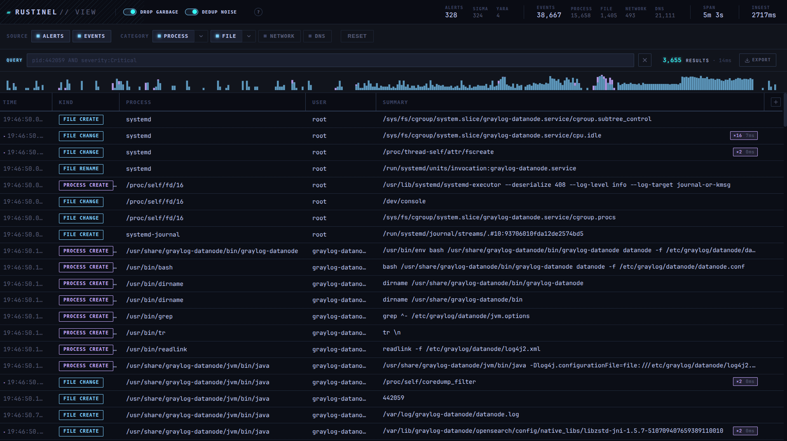
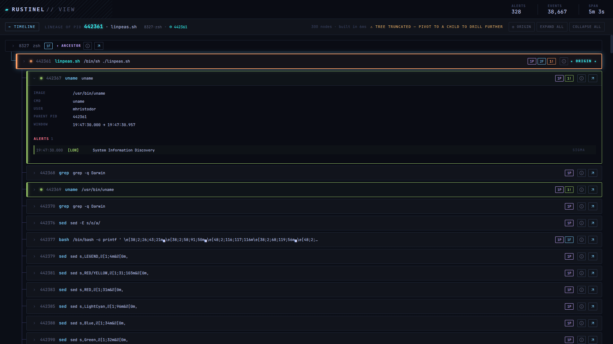

# rustinel-view

A read-only triage UI for [Rustinel](https://github.com/Karib0u/rustinel) EDR
snapshots. Give it an alerts file and an events log; it merges them into one
process-aware timeline you can filter, pivot, and walk in the browser.

It is a companion tool, not part of Rustinel. Rustinel does the detection and
writes the logs. This reads those logs after the fact. There is no live agent,
no database to stand up, and no API to wire into a SIEM.



## How it works

When the binary starts it:

1. Boots an in-process Redis ([miniredis](https://github.com/alicebob/miniredis)), so there is nothing to install.
2. Parses the alerts JSON and the events log into that store.
3. Decodes one read snapshot up front, so the first page is as fast as the hundredth.
4. Serves plain server-rendered HTML, driven by HTMX.

The data only lives as long as the process. Quit the binary and it is gone.
Nothing is written back to disk.

## Inputs

Rustinel produces two files. Those are the two inputs here:

| Input | Rustinel file | What it is |
|-------|---------------|------------|
| alerts | `logs/alerts.json.<date>` | Detections, one ECS NDJSON document per line |
| events | `logs/rustinel.log.<date>` | Operational log; the viewer pulls the `normalized_json=` telemetry lines out of it |

The events input only has data if Rustinel is logging at `trace`. The
normalized telemetry lines are emitted at `trace` and nowhere else. At the
default `info` level the operational log carries no `normalized_json=` lines,
so the events timeline comes up empty. See step 2 below.

## Build

```sh
go build -o rustinel-view ./cmd/rustinel-view   # needs Go 1.26+
```

## Quick start

**1. Build it** (above).

**2. Turn on trace telemetry in Rustinel.** In `config.toml`:

```toml
[logging]
level = "trace"      # normalized events are trace-level only
directory = "logs"
```

`trace` on everything is noisy. Only the `engine` target needs it, so a target
filter keeps the rest at `info`:

```toml
[logging]
filter = "info,engine=trace"
directory = "logs"
```

**3. Run Rustinel and do something it can see.**

```sh
sudo ./rustinel run
```

It now writes `logs/alerts.json.<date>` and `logs/rustinel.log.<date>`.

**4. Point the viewer at both files.**

```sh
RV_ALERTS=logs/alerts.json.<date> \
RV_EVENTS=logs/rustinel.log.<date> \
./run.sh
```

Open <http://127.0.0.1:18080/>.

## Walkthrough: a `whoami` detection

Rustinel ships a demo Sigma rule that fires on `whoami`. With the agent running
at trace level, run it:

```sh
whoami
```

You get:

- an alert in `logs/alerts.json.<date>` (`rule.name: "Example - Whoami Execution"`, `edr.rule.engine: Sigma`, `process.name: whoami`);
- the events around it in `logs/rustinel.log.<date>`: the `whoami` process start, its parent shell, and the file and network activity nearby, each a `normalized_json=` line.

Load both files and open the page. From there you can:

- find the `whoami` alert at the top of the killchain;
- click it for the full ECS record;
- open lineage (`GET /lineage/{pid}`) to see which shell spawned `whoami` and what else that shell touched;
- filter with the query bar, e.g. `name:whoami` or `engine:Sigma severity:Low`.

Lineage rebuilds the process tree from one PID, folds the matching alerts onto
each node, and lets you pivot to any child to keep digging.



## Running it directly

```sh
rustinel-view [flags] <alerts.json> <events.log>
```

| Flag | Default | Description |
|------|---------|-------------|
| `-addr` | `:8080` | HTTP listen address |
| `-log-level` | `info` | `debug` \| `info` \| `warn` \| `error` |
| `-redis-port` | `0` | embedded miniredis port (0 = OS-assigned) |
| `-no-flush` | `false` | skip `FLUSHALL` at startup (debugging aid) |

### run.sh

`run.sh` builds and launches in one step. Pass the snapshot paths as env vars,
or drop them in a local, gitignored `.run.env` next to the script:

```sh
# .run.env
RV_ALERTS=/path/to/alerts.json
RV_EVENTS=/path/to/rustinel.log
# RV_ADDR=0.0.0.0:18080   # expose on the LAN (read the security note first)
```

```sh
./run.sh
```

Overrides: `RV_ALERTS`, `RV_EVENTS`, `RV_ADDR` (default `127.0.0.1:18080`), `RV_LOG`.

## Security

There is no auth and no TLS. Anyone who can reach the port can read the whole
EDR snapshot. That is why the default bind is loopback only (`127.0.0.1`). Only
bind to `0.0.0.0` or a LAN address on a network you trust.

## Query language

A small KQL-style language over the timeline. A query is a boolean expression of
`field:value` tests plus bare-term substring search, joined with `AND`, `OR`,
`NOT`, and parentheses. The fields are unified across alerts and events, so one
expression filters both kinds of row.

Fields:

```
kind  pid  parent_pid  name  image  parent_image  cmdline  parent_cmdline
user  category  action  severity  rule  engine  target  query  record
src  dst  src_port  dst_port  proto
```

Examples:

```
category:Process AND NOT user:root
image:/usr/bin/rm cmdline:tmp
engine:Sigma severity:High
proto:tcp dst_port:443
```

## HTTP routes

| Route | Purpose |
|-------|---------|
| `GET /` | main triage page |
| `GET /timeline` | timeline rows (HTMX fragment) |
| `GET /count` / `GET /density` | result count / time-bucket histogram |
| `GET /lineage/{pid}` | process-tree lineage for a PID |
| `GET /detail/{kind}/{id}` | full record detail (`a` alert / `e` event) |
| `GET /json/{kind}/{id}` | raw normalized JSON for a record |
| `GET /export` | export the current result set as NDJSON |
| `GET /query/{schema,check,values}` | query autocomplete and validation |

## Project layout

```
cmd/rustinel-view/     entrypoint: ingest, warm, serve
internal/ingest/       alert + event parsers
internal/store/        miniredis-backed store, query language, lineage
internal/server/       HTTP handlers, templates, embedded static assets
```

## Built on Rustinel

[Rustinel](https://github.com/Karib0u/rustinel) is an open-source,
cross-platform EDR (ETW / eBPF / Endpoint Security) with Sigma, YARA, and IOC
detection that emits ECS NDJSON alerts. It is licensed under Apache 2.0. All of
the detection logic and telemetry that this viewer renders comes from Rustinel;
rustinel-view just reads its output. Credit for the EDR goes to its author,
[Karib0u](https://github.com/Karib0u).

## License

Copyright (C) 2026 Mihail Hristodor.

rustinel-view is licensed under the GNU Affero General Public License v3.0. See
[LICENSE](LICENSE) for the full text. In short: you are free to use, study,
modify, and share it, but if you run a modified version as a network service,
you have to make your modified source available to its users under the same
license.
